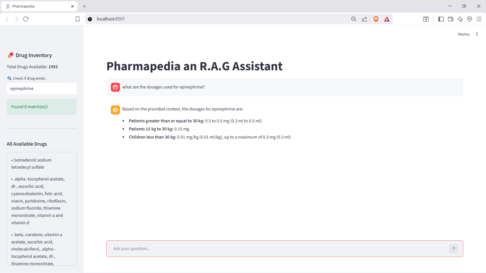
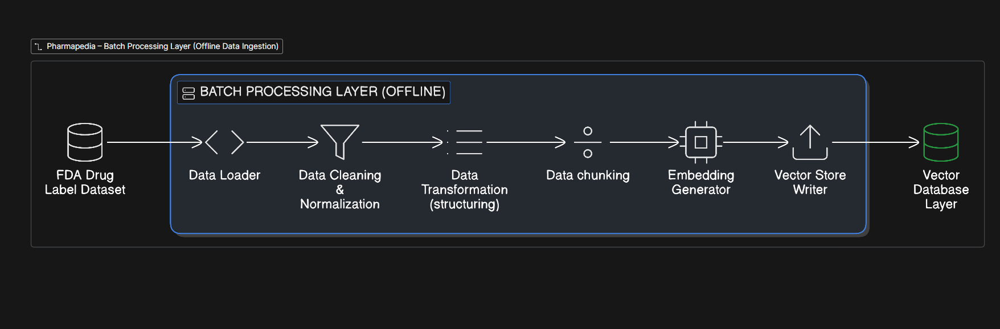
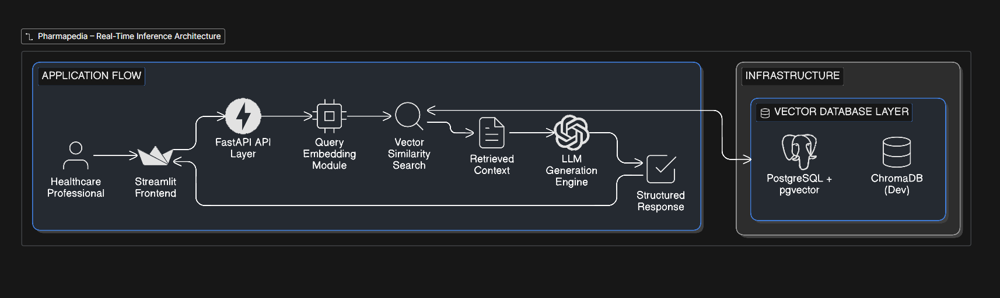
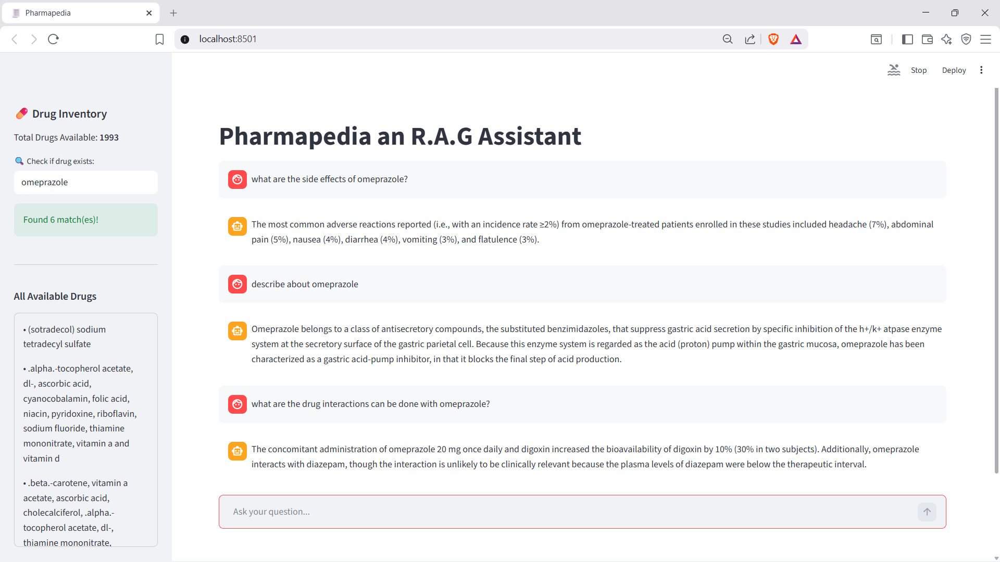
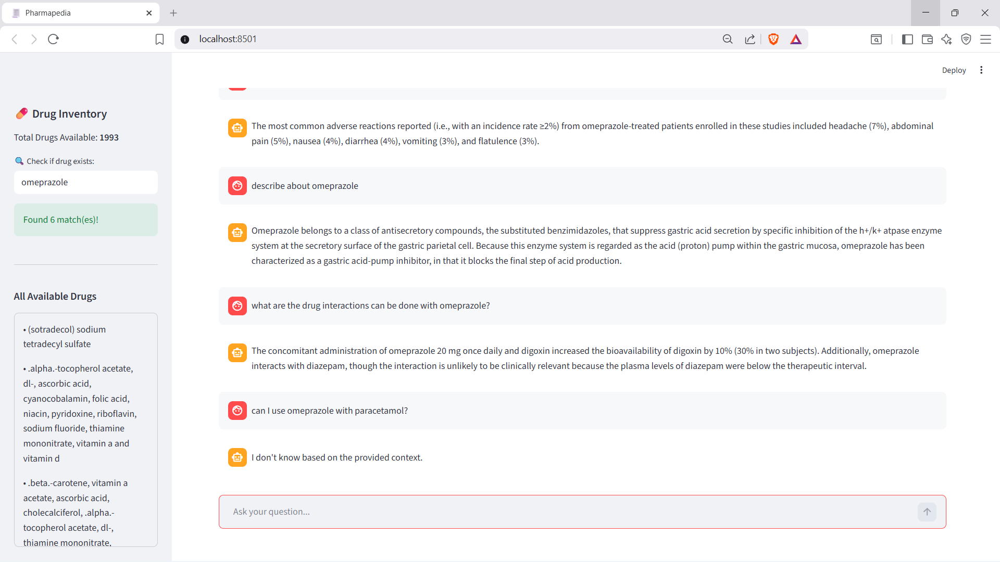

# Pharmapedia – Retrieval-Augmented Pharmaceutical Assistant

Pharmapedia is a Retrieval-Augmented Generation (RAG) system built to answer pharmaceutical queries using structured drug label data from FDA. The system processes 2,000 labeled drug records containing multiple sections such as Dosage & Administration, Indications, Warnings, Contraindications, and Pharmacology.


*Figure 1: Pharmapedia Interface showing a grounded response for Epinephrine dosage.*
# Problem Statement

Accurate pharmaceutical question answering requires strict grounding in regulatory-approved medical documentation. Large Language Models (LLMs), when used independently, are prone to hallucination and may generate unsafe or unverifiable medical responses. Official drug labeling published by the U.S. Food and Drug Administration (FDA) contains authoritative information regarding dosage, indications, contraindications, warnings, and administration guidelines. However, these documents are lengthy, complex, and not optimized for semantic search or natural language querying.

Traditional keyword-based search systems fail to capture contextual intent within medical queries, often retrieving incomplete or irrelevant sections.

There is a need for a scalable Retrieval-Augmented Generation (RAG) system that:

- Retrieves semantically relevant sections exclusively from FDA-approved drug labeling
- Grounds every generated response in official regulatory documentation
- Minimizes hallucination risk
- Provides accurate, context-aware pharmaceutical answers within a production-grade architecture

# Solution Overview

Pharmapedia is a production-oriented Retrieval-Augmented Generation (RAG) system built on official drug labeling published by the U.S. Food and Drug Administration.

The system processes 2,000 structured FDA drug label records and converts them into vector embeddings for semantic search. Each drug label is segmented into clinically meaningful sections (e.g., Dosage & Administration, Indications, Warnings) to preserve contextual integrity during retrieval.

When a user submits a query, the system retrieves semantically relevant sections from FDA-approved labeling using vector similarity search and injects the retrieved context into an LLM to generate a grounded response.

Pharmapedia follows a modular full-stack architecture with a Streamlit frontend, FastAPI backend, and a vector database layer supporting ChromaDB for local development and PostgreSQL with pgvector for production deployment.

# System Architecture

The batch processing pipeline ingests FDA datasets, performs data cleaning and transformation, splits content into optimized chunks, generates embeddings, and stores them in a vector database (ChromaDB for local development and PostgreSQL with pgvector for production). This pipeline runs asynchronously and prepares the knowledge base for semantic retrieval.



The real-time inference layer processes user queries through a Streamlit frontend and FastAPI backend. The system generates query embeddings, retrieves relevant chunks using semantic search (Top-K/MMR), and passes the context to an LLM for response generation. The final answer is returned to the user with low-latency processing.



# End-to-End Workflow

## Offline Data Preparation

- FDA drug label data is loaded into the system
- The data is cleaned and standardized
- Content is structured into meaningful clinical sections as page_content with metadata
- Documents are split into optimized chunks
- Each chunk is converted into a vector embedding
- Embeddings and metadata are stored in the vector database
- At this stage, the knowledge base becomes semantically searchable

## Real-Time Query Processing

- A user submits a pharmaceutical query through the frontend
- The backend receives and validates the request
- The query is converted into an embedding
- A similarity search (Top-K or MMR) is performed in the vector database
- Relevant FDA-approved sections are retrieved
- Retrieved context is injected into the language model
- The LLM generates a grounded response
- The final answer is returned to the user interface
- All responses are generated strictly from retrieved FDA labeling content

# Core Features

## FDA-Grounded Knowledge Base
Built exclusively on structured drug labeling data from the U.S. Food and Drug Administration. All responses are generated strictly from retrieved regulatory-approved content.


*Figure 2: The assistant handling complex queries regarding side effects and drug-to-drug interactions.*
## End-to-End Data Processing Pipeline

Implements a complete offline ingestion workflow:

- Data loading
- Cleaning & normalization
- Section-based transformation
- Intelligent chunking
- Embedding generation
- Vector database indexing

## Semantic Vector Retrieval

- Embedding-based similarity search
- Cosine similarity
- Top-K retrieval
- MMR (Maximal Marginal Relevance) support

## Dual Vector Database Support

- ChromaDB (local development)
- PostgreSQL + pgvector (production-ready setup)

## Modular RAG Architecture

Clear separation of:

- Ingestion layer
- Retrieval layer
- LLM generation layer
- Frontend interface

## Full-Stack Deployment Ready

- Streamlit frontend
- FastAPI backend
- Dockerized PostgreSQL setup

# Tech Stack

- Frontend: Streamlit
- Backend: FastAPI
- Database: PostgreSQL + pgvector
- Embeddings: BAAI/bge-large-en-v1.5
- LLM: GLM-4.7-Flash
- Containerization: Docker

# Database Design

Primary table:

| Column        | Type         | Description                         |
|---------------|-------------|-------------------------------------|
| id            | varchar (PK)| Primary key                          |
| collection_id | uuid        | Collection identifier               |
| embedding     | vector(1024)| Chunk embedding                      |
| document      | varchar     | Original document                   |
| cmetadata     | jsonb       | Metadata for filtering               |

Indexes:

- Primary Key: btree (id)  
- Vector Similarity Index: HNSW (embedding vector_cosine_ops) – Enables fast approximate nearest neighbor (ANN) cosine similarity search  
- Metadata Index: GIN (cmetadata jsonb_path_ops) – Supports structured filtering and future extensibility  

Embeddings stored using pgvector for efficient cosine similarity search.  
Metadata stored in JSONB for flexible filtering and extensibility.  
Chunk-level granularity improves retrieval precision.  
Indexed on embedding column for fast Top-K search.

# Retrieval Strategy

## Query Embedding

User queries are converted into dense vector embeddings using the same model as for indexing. Ensures alignment between query and stored chunks for accurate semantic matching.

## Vector Similarity Search

Query embeddings are compared with stored chunk embeddings using:

- Cosine similarity
- HNSW index for efficient ANN search
- Top-K retrieval to select the most relevant sections

## Context-Aware Chunking

Drug labels are pre-processed into clinically meaningful sections (e.g., Dosage, Warnings, Indications, Contraindications). Section-aware chunking improves retrieval precision and reduces irrelevant matches.

## Metadata Support

Each chunk stores structured metadata (jsonb) for filtering by attributes like drug name or section type. GIN indexes enable efficient metadata queries when needed.

## Retrieval-Augmented Generation (RAG)
Top-K retrieved chunks are passed as context to the LLM. The model generates answers grounded strictly in retrieved FDA-approved content.


*Figure 3: Hallucination prevention - the assistant acknowledges when information (like paracetamol interaction) is not present in the local FDA context.*
### Key Configuration

- Chunk Size: Optimized to preserve context and improve retrieval precision
- Overlap Size: Ensures continuity across chunks for better semantic understanding
- Similarity Metric: Cosine similarity between query and chunk embeddings
- Top-K Value: Returns the most relevant chunks per query
- Optional Features: Supports Maximal Marginal Relevance (MMR) and metadata-based filtering to reduce redundancy and improve content diversity

# FastAPI Endpoints

**POST /query** – Accepts user queries and returns answers grounded in retrieved FDA-approved drug label content

**Request:**
```json
{
  "question": "What is the adult dose of loratadine?"
}
```
**Response**:
```json
{
  "answer": "The adult dose of loratadine is 10 mg daily."
}
```
# Installation & Setup

## Clone the repository
git clone https://github.com/Kavinsarathi/Pharmapedia-an-RAG-assistant.git
cd Pharmapedia-an-RAG-assistant/Pharmapedia

## Set environment variables
- Configure API keys, DB credentials

## Database setup
CREATE DATABASE pharmapedia;
\c pharmapedia
CREATE EXTENSION IF NOT EXISTS vector;

CREATE TABLE your_table_name (
    id SERIAL PRIMARY KEY,
    content TEXT,
    embedding vector(1536),
    metadata JSONB
);

## Install Python dependencies
pip install -r requirements.txt

## Run backend & frontend
uvicorn app:app --reload
streamlit run frontend.py

# Docker Setup (Optional)

## Pull pgvector Docker image
docker pull ankane/pgvector

## Run container
docker run -d -p 5432:5432 --name pharma_pgvector ankane/pgvector

- Configure ports in .env accordingly
