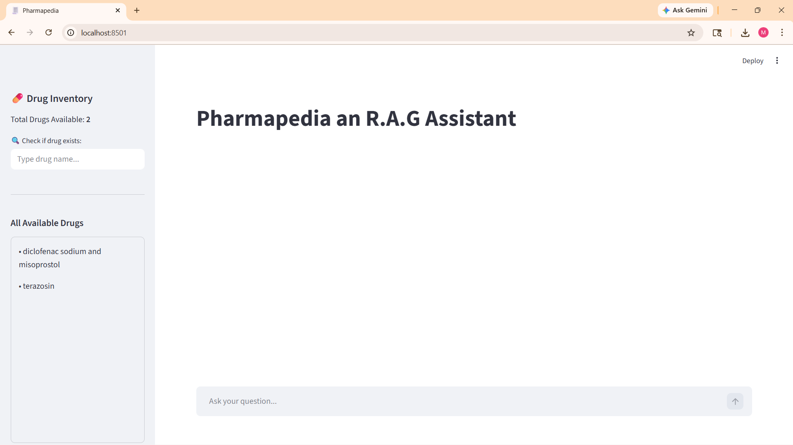
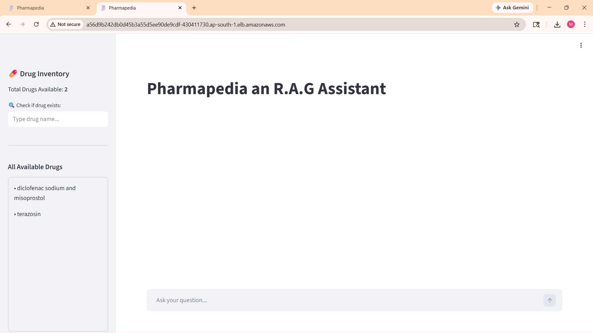
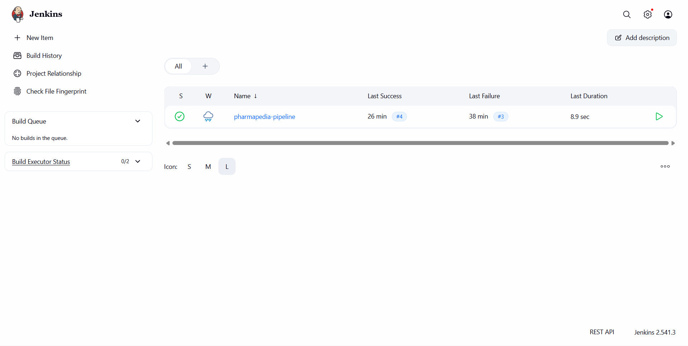
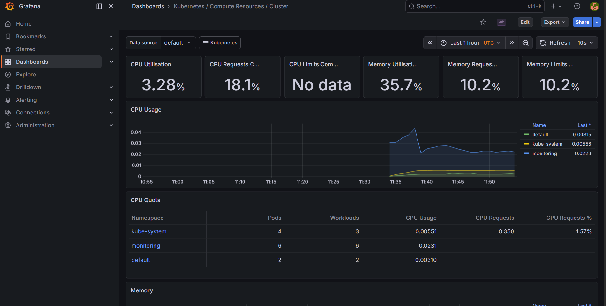
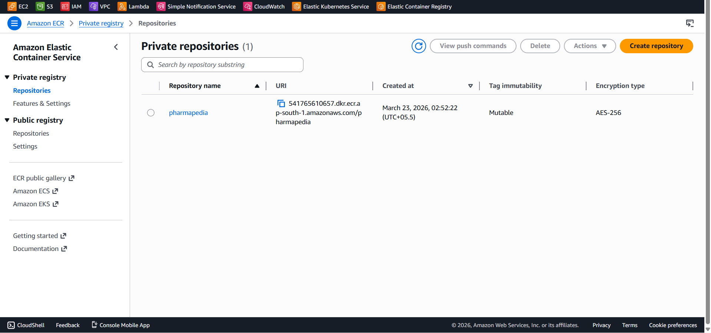
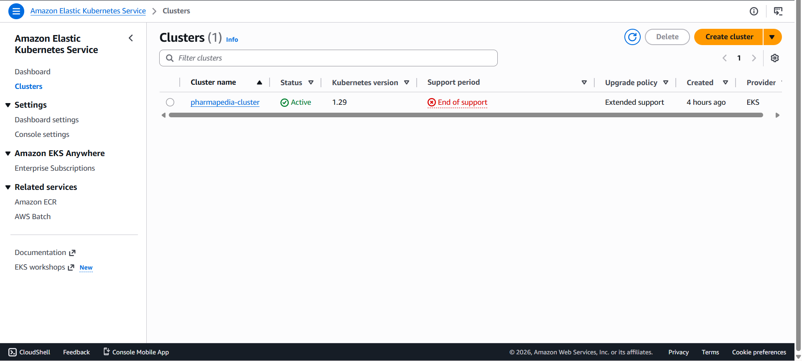

<div align="center">


---

# 💊 Pharmapedia — RAG Assistant

### *An AI-powered pharmaceutical information assistant, fully deployed on AWS using a production-grade DevOps pipeline*

[](https://www.docker.com/)
[](https://www.terraform.io/)
[](https://www.ansible.com/)
[](https://www.jenkins.io/)
[](https://kubernetes.io/)
[](https://aws.amazon.com/)
[](https://grafana.com/)
[](https://prometheus.io/)
[](https://python.org/)
[](https://langchain.com/)

</div>

---

## 📋 Table of Contents

- [🎯 Project Overview](#-project-overview)
- [🏗️ Architecture](#️-architecture)
- [🛠️ Tech Stack](#️-tech-stack)
- [📸 Screenshots](#-screenshots)
- [📁 Project Structure](#-project-structure)
- [🚀 Deployment Guide](#-deployment-guide)
  - [Phase 1 — Docker Setup](#phase-1--docker-setup-local)
  - [Phase 2 — AWS Infrastructure with Terraform](#phase-2--aws-infrastructure-with-terraform)
  - [Phase 3 — Kubernetes Deployment](#phase-3--kubernetes-deployment)
  - [Phase 4 — Jenkins CI/CD Pipeline](#phase-4--jenkins-cicd-pipeline)
  - [Phase 5 — Monitoring with Prometheus & Grafana](#phase-5--monitoring-with-prometheus--grafana)
- [⚙️ Environment Variables](#️-environment-variables)
- [💰 AWS Cost Estimate](#-aws-cost-estimate)
- [🧹 Cleanup](#-cleanup)

---

## 🎯 Project Overview

**Pharmapedia** is a Retrieval-Augmented Generation (RAG) application that allows healthcare professionals and patients to ask natural language questions about pharmaceutical drugs. The app retrieves relevant drug information from a **pgvector** database and generates accurate, context-aware answers using a Large Language Model.

This project demonstrates a **complete end-to-end production DevOps pipeline** — from local Docker development all the way to a publicly accessible, monitored, auto-deploying application running on AWS.

### ✨ Key Features

| Feature | Description |
|--------|-------------|
| 🤖 **RAG Architecture** | Retrieves relevant drug info from vector DB before generating answers |
| 💊 **Drug Inventory** | Search and browse available pharmaceutical data |
| 🐳 **Fully Dockerized** | App + pgvector DB run as containers |
| ☁️ **AWS Native** | Runs on EKS with ECR image storage |
| 🔄 **CI/CD Automated** | Jenkins auto-builds and deploys on every code push |
| 📊 **Live Monitoring** | Real-time metrics via Prometheus + Grafana |

---

## 🏗️ Architecture

```
Developer Laptop
      │
      │  git push
      ▼
┌─────────────────┐
│    GitHub Repo   │  ◄── Source of Truth
│  (pharmapedia-  │
│    devops)       │
└────────┬────────┘
         │  Webhook / Manual Trigger
         ▼
┌─────────────────┐
│  Jenkins Server  │  ◄── EC2 t3.medium (13.232.233.197:8080)
│  CI/CD Pipeline  │
│  1. Checkout     │
│  2. Docker Build │
│  3. Push to ECR  │
│  4. kubectl apply│
└────────┬────────┘
         │
         ▼
┌─────────────────┐
│   AWS ECR        │  ◄── Docker Image Registry
│  (pharmapedia)   │      541765610657.dkr.ecr.ap-south-1
└────────┬────────┘
         │  Pull image
         ▼
┌──────────────────────────────────────────────────┐
│              AWS EKS Cluster                      │
│           (pharmapedia-cluster / ap-south-1)      │
│                                                   │
│  ┌─────────────────┐   ┌────────────────────┐    │
│  │  default NS      │   │  monitoring NS      │    │
│  │                  │   │                    │    │
│  │  pharmapedia-app │   │  prometheus        │    │
│  │  (Streamlit Pod) │   │  grafana           │    │
│  │                  │   │  alertmanager      │    │
│  │  pgvector Pod    │   │  node-exporter     │    │
│  │  (PostgreSQL+    │   └────────────────────┘    │
│  │   pgvector ext)  │                             │
│  └─────────────────┘                             │
│                                                   │
│  ┌────────────────────────────────────────────┐  │
│  │         AWS LoadBalancer (Public)           │  │
│  │  a56d9b242db0d45b3a55d5ee90de9cdf-         │  │
│  │  430411730.ap-south-1.elb.amazonaws.com     │  │
│  └────────────────────────────────────────────┘  │
└──────────────────────────────────────────────────┘
         │
         ▼
     🌍 Internet
  (Anyone can access)
```

---

## 🛠️ Tech Stack

| Category | Technology | Purpose |
|----------|-----------|---------|
| **Application** | Python 3.11 + Streamlit | Frontend UI |
| **AI/RAG** | LangChain + GLM-4.7-Flash | LLM chaining & response generation |
| **Embeddings** | BAAI/bge-large-en-v1.5 | Sentence embeddings via sentence-transformers |
| **Vector Database** | pgvector (PostgreSQL extension) | Similarity search on drug embeddings |
| **Containerization** | Docker + Docker Compose | Local development & image building |
| **Image Registry** | AWS ECR | Stores Docker images |
| **Infrastructure** | Terraform | Provisions all AWS resources as code |
| **Configuration** | Ansible | Server setup & tool installation |
| **CI/CD** | Jenkins | Automated build, push & deploy pipeline |
| **Container Orchestration** | Kubernetes (AWS EKS) | Runs and manages all pods |
| **Metrics Collection** | Prometheus | Scrapes cluster & app metrics |
| **Dashboards** | Grafana | Visualizes metrics with pre-built dashboards |
| **Package Manager (K8s)** | Helm | Installs Prometheus + Grafana stack |
| **Cloud Provider** | AWS (EKS, ECR, EC2, VPC) | All cloud infrastructure |

---

## 📸 Screenshots

### 🖥️ Application Running Locally (Docker)

> App running at `http://localhost:8501` — Streamlit frontend with pgvector DB as Docker containers




---

### 🌍 Application Live on AWS

> App publicly accessible via AWS LoadBalancer — deployed on EKS Kubernetes cluster




---

### 🔄 Jenkins CI/CD Pipeline

> Jenkins pipeline showing successful build #4 — automated Docker build, ECR push, and EKS deployment



---

### 📊 Grafana Monitoring Dashboard

> Live cluster metrics — CPU 3.28%, Memory 35.7%, showing all 3 namespaces (default, monitoring, kube-system)



---

### 📦 AWS ECR Repository

> Docker image repository `pharmapedia` in AWS Elastic Container Registry (ap-south-1)


---

### ☸️ AWS EKS Cluster

> `pharmapedia-cluster` running on Kubernetes 1.29, Active status on AWS EKS




---

## 📁 Project Structure

```
pharmapedia-devops/
│
├── 📄 Jenkinsfile                         # CI/CD pipeline definition
├── 📄 docker-compose.yml                  # Local dev with app + pgvector
├── 📄 README.md                           # This file
│
├── 📁 Pharmapedia/                        # Main application code
│   ├── 📄 Dockerfile                      # App container definition
│   ├── 📄 requirement.txt                 # Python dependencies
│   ├── 📄 .env                            # Environment variables (gitignored)
│   ├── 📄 frontend.py                     # Streamlit UI
│   ├── 📄 app.py                          # FastAPI backend (optional)
│   ├── 📄 chaining.py                     # RAG chain logic
│   ├── 📄 create_vectordb.py              # pgvector DB setup
│   ├── 📄 config.py                       # Configuration & env loading
│   ├── 📄 utils.py                        # Helper functions
│   ├── 📄 embedding.py                    # Embedding generation
│   ├── 📄 data_loader.py                  # Load raw drug data
│   ├── 📄 data_cleaning.py                # Clean drug data
│   ├── 📄 data_chunking.py                # Chunk documents
│   ├── 📄 data_transformation.py          # Transform for vectorization
│   └── 📄 drugs.txt                       # Drug list
│
├── 📁 terraform/                          # AWS Infrastructure as Code
│   ├── 📄 main.tf                         # AWS provider config
│   ├── 📄 ecr.tf                          # ECR repository
│   ├── 📄 eks.tf                          # EKS cluster + VPC + node groups
│   └── 📄 jenkins-ec2.tf                  # Jenkins EC2 instance
│
├── 📁 k8s/                               # Kubernetes manifests
│   ├── 📄 app-deployment.yaml             # Pharmapedia app deployment + service
│   └── 📄 pgvector-deployment.yaml        # pgvector DB deployment + service
│
└── 📁 assets/
    └── 📁 screenshots/                    # README images
```

---

## 🚀 Deployment Guide

### Prerequisites

Before starting, make sure you have the following installed and configured:

- ✅ Docker Desktop
- ✅ AWS CLI (`aws configure` with IAM user credentials)
- ✅ Terraform (`v1.14+`)
- ✅ kubectl
- ✅ Helm (`v3.14+`)
- ✅ Git

---

### Phase 1 — Docker Setup (Local)

**Step 1 — Clone the repository**
```bash
git clone https://github.com/MuruganM09/pharmapedia-devops.git
cd pharmapedia-devops
```

**Step 2 — Create your `.env` file inside `Pharmapedia/`**
```env
DB_USER=postgres
DB_PASSWORD=pgvector_db
DB_HOST=pgvector_db
DB_PORT=5432
DB_NAME=pgvector_bge
GLM_API_KEY=your_api_key_here
```

**Step 3 — Build and run locally with Docker Compose**
```bash
docker-compose up --build
```

**Step 4 — Open the app**
```
http://localhost:8501
```

> ✅ Both the Streamlit app and pgvector database will start as Docker containers.

---

### Phase 2 — AWS Infrastructure with Terraform

**Step 1 — Configure AWS CLI**
```bash
aws configure
# Enter: Access Key ID, Secret Access Key, region: ap-south-1, format: json
```

**Step 2 — Initialize Terraform**
```bash
cd terraform/
terraform init
```

**Step 3 — Preview infrastructure changes**
```bash
terraform plan
```

**Step 4 — Apply — creates all AWS resources**
```bash
terraform apply
# Type: yes
```

> ⏱️ This takes **15–20 minutes**. It provisions:
> - VPC with public and private subnets
> - EKS cluster (`pharmapedia-cluster`, Kubernetes 1.29)
> - EKS managed node group (t3.medium)
> - ECR repository (`pharmapedia`)
> - Jenkins EC2 instance (t3.medium)
> - All IAM roles, security groups, NAT gateway

**Step 5 — Connect kubectl to EKS**
```bash
aws eks update-kubeconfig --region ap-south-1 --name pharmapedia-cluster
kubectl get nodes
```

---

### Phase 3 — Kubernetes Deployment

**Step 1 — Push Docker image to ECR**
```bash
# Login to ECR
aws ecr get-login-password --region ap-south-1 | \
  docker login --username AWS --password-stdin \
  541765610657.dkr.ecr.ap-south-1.amazonaws.com

# Tag image
docker tag pharmapedia-app:latest \
  541765610657.dkr.ecr.ap-south-1.amazonaws.com/pharmapedia:latest

# Push
docker push 541765610657.dkr.ecr.ap-south-1.amazonaws.com/pharmapedia:latest
```

**Step 2 — Deploy to Kubernetes**
```bash
cd k8s/
kubectl apply -f app-deployment.yaml
kubectl apply -f pgvector-deployment.yaml
```

**Step 3 — Verify pods are running**
```bash
kubectl get pods
kubectl get services
```

Expected output:
```
NAME                               READY   STATUS    RESTARTS   AGE
pharmapedia-app-6468b767c9-zmxkn   1/1     Running   0          2m
pgvector-7c86cdf4f8-xdnnb          1/1     Running   0          2m
```

**Step 4 — Get the public URL**
```bash
kubectl get services pharmapedia-service
```

Copy the `EXTERNAL-IP` and open it in your browser — your app is live! 🌍

---

### Phase 4 — Jenkins CI/CD Pipeline

**Step 1 — Access Jenkins**

After Terraform applies, Jenkins is available at:
```
http://<jenkins_public_ip>:8080
```

Get the initial admin password from the EC2 server:
```bash
# Connect via AWS Console → EC2 Instance Connect
sudo cat /home/jenkins/.jenkins/secrets/initialAdminPassword
```

**Step 2 — Configure AWS Credentials in Jenkins**

```
Manage Jenkins → Credentials → System → Global Credentials
→ Add Credentials → AWS Credentials
  ID: aws-credentials
  Access Key ID: your_key
  Secret Access Key: your_secret
```

**Step 3 — Create Pipeline Job**

```
New Item → pharmapedia-pipeline → Pipeline
→ Pipeline script from SCM
  SCM: Git
  Repository URL: https://github.com/MuruganM09/pharmapedia-devops.git
  Branch: */main
  Script Path: Jenkinsfile
→ Save
```

**Step 4 — The Jenkinsfile pipeline stages**

```groovy
pipeline {
    agent any
    environment {
        ECR_REPO = "541765610657.dkr.ecr.ap-south-1.amazonaws.com/pharmapedia"
        AWS_REGION = "ap-south-1"
        CLUSTER_NAME = "pharmapedia-cluster"
    }
    stages {
        stage('Checkout')         { ... }  // Pull code from GitHub
        stage('Build Docker Image') { ... }  // docker build
        stage('Push to ECR')      { ... }  // docker push to AWS ECR
        stage('Deploy to EKS')    { ... }  // kubectl set image
    }
}
```

**Step 5 — Trigger a build**

Click **▶ Build Now** — Jenkins will automatically:
1. Pull code from GitHub
2. Build a new Docker image
3. Push it to AWS ECR with build number tag
4. Update the running Kubernetes deployment with the new image

---

### Phase 5 — Monitoring with Prometheus & Grafana

**Step 1 — Install Helm**
```bash
# Download and add to PATH
curl -LO https://get.helm.sh/helm-v3.14.0-linux-amd64.tar.gz
tar -xzf helm-v3.14.0-linux-amd64.tar.gz
mv linux-amd64/helm /usr/local/bin/
```

**Step 2 — Add Prometheus Helm repo**
```bash
helm repo add prometheus-community https://prometheus-community.github.io/helm-charts
helm repo update
```

**Step 3 — Install kube-prometheus-stack**
```bash
helm install monitoring prometheus-community/kube-prometheus-stack \
  --namespace monitoring \
  --create-namespace
```

> This installs: **Prometheus**, **Grafana**, **AlertManager**, **Node Exporter**, and **Kube State Metrics** — all pre-configured and ready.

**Step 4 — Access Grafana**
```bash
# Port-forward to your laptop
kubectl --namespace monitoring port-forward svc/monitoring-grafana 3000:80

# Get Grafana password
kubectl get secret --namespace monitoring monitoring-grafana \
  -o jsonpath="{.data.admin-password}" | base64 --decode
```

Open `http://localhost:3000` — login with `admin` and the decoded password.

**Step 5 — View dashboards**

Navigate to: **Dashboards → Kubernetes → Kubernetes / Compute Resources / Cluster**

You'll see live metrics for your entire EKS cluster including CPU usage, memory consumption, pod counts, and network traffic per namespace.

---

## ⚙️ Environment Variables

| Variable | Description | Example |
|----------|-------------|---------|
| `DB_USER` | PostgreSQL username | `postgres` |
| `DB_PASSWORD` | PostgreSQL password | `pgvector_db` |
| `DB_HOST` | DB hostname (Docker service name in compose, K8s service name in EKS) | `pgvector_db` or `pgvector-service` |
| `DB_PORT` | PostgreSQL port | `5432` |
| `DB_NAME` | Database name | `pgvector_bge` |
| `GLM_API_KEY` | API key for GLM-4.7-Flash LLM | `your_key_here` |

> ⚠️ **Never commit your `.env` file to GitHub.** It is listed in `.gitignore`.

---

## 💰 AWS Cost Estimate

| Resource | Type | Cost (approx.) |
|----------|------|---------------|
| EKS Cluster | Managed control plane | ~$0.10/hr |
| EKS Node | t3.medium EC2 | ~$0.04/hr |
| Jenkins Server | t3.medium EC2 | ~$0.04/hr |
| NAT Gateway | Data processing | ~$0.05/hr |
| ECR Storage | Docker image layers | ~$0.01/GB/month |
| LoadBalancer | Classic ELB | ~$0.02/hr |
| **Total** | | **~$5–7/day** |

> 💡 **Tip:** Destroy resources when not in use to avoid charges. See [Cleanup](#-cleanup) section.

---

## 🧹 Cleanup

When you are done practicing, destroy all AWS resources to stop billing:

```bash
cd terraform/
terraform destroy
# Type: yes when prompted
```

This removes:
- ✅ EKS cluster and all node groups
- ✅ EC2 Jenkins server
- ✅ VPC, subnets, NAT gateway
- ✅ Security groups and IAM roles
- ✅ All associated networking

> ⚠️ **Note:** The ECR repository and its images are also destroyed. The `.tfstate` file remains locally so you can recreate everything with `terraform apply`.

---

## 🤝 Contributing

1. Fork the repo
2. Create a feature branch: `git checkout -b feature/my-feature`
3. Commit your changes: `git commit -m 'Add my feature'`
4. Push to branch: `git push origin feature/my-feature`
5. Open a Pull Request

---

## 📄 License

This project is open source and available under the [MIT License](LICENSE).

---

<div align="center">

**Built with ❤️ by Murugan M**

[](https://github.com/MuruganM09)

*From laptop → Docker → GitHub → Jenkins → ECR → EKS → Internet* 🚀

</div>
